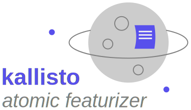

# User Guide to Atomic Featurizer Kallisto

We provide a number of detailed guides dealing with common task that can be performed easily with the kallisto program. All guides are usually structured the same way, starting with some simple examples using only the commandline and the default settings followed by a trouble shooting section. Detailed inputs are provided in a ready to use fashion to solve some more special but still common tasks with `kallisto` together with some insights into the theory used behind the scences.

```
> kallisto --verbose commands arguments
```




