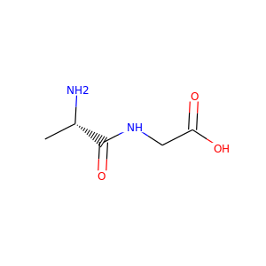
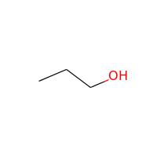
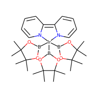

# Check the Examples

During the next sections, we exemplify the calculation of all atomic features for several molecules as depicted below. The coordinates of all molecules are given in an [`xmol` format](https://en.wikipedia.org/wiki/XYZ_file_format). We have furthermore extracted 135 `xmol` structures for organic molecules and transition metal complexes that have been optimized at the [CAM-B3LYP-D3\(B\)/def2-TZVP](https://doi.org/10.1063/1.4932594) level of theory, which can be used for testing purposes as well. 


`xmol` files can be nicely visualized using the GUI of the [atomic simulation environment](https://wiki.fysik.dtu.dk/ase/).


#### Alanine-glycine



```bash
> cat alanine-glycine.xyz
20
Alanine-Glycine
C     2.081440     0.615100    -0.508430
C     2.742230     1.824030    -1.200820
N     4.117790     1.799870    -1.190410
C     4.943570     2.827040    -1.822060
C     6.440080     2.569360    -1.637600
O     7.351600     3.252270    -2.069090
N     0.610100     0.695090    -0.538780
O     2.095560     2.724940    -1.739670
O     6.705220     1.463410    -0.897460
H     0.303080     1.426060     0.103770
H     0.338420     1.050680    -1.460480
C     2.488753    -0.593400    -1.198448
H     2.416500     0.557400     0.532050
H     4.614100     1.081980    -0.670550
H     4.699850     3.794460    -1.373720
H     4.722890     2.844690    -2.894180
H     7.687400     1.448620    -0.860340
H     2.029201    -1.457008    -0.719999
H     2.170233    -0.542411    -2.238576
H     3.572730    -0.688405    -1.154998
```

#### Toluene


```bash
> cat toluene.xyz
15
Toluene
C      1.2264      0.0427      0.0670
C      1.0031     -1.3293      0.0600
C     -0.2945     -1.8256     -0.0060
C     -1.3704     -0.9461     -0.0646
C     -1.1511      0.4266     -0.0578
C      0.1497      0.9292      0.0066
C      0.3871      2.3956     -0.0022
H      2.2495      0.4310      0.1211
H      1.8510     -2.0202      0.1071
H     -0.4688     -2.9062     -0.0109
H     -2.3926     -1.3347     -0.1157
H     -2.0006      1.1172     -0.1021
H      0.5024      2.7582     -1.0330
H      1.2994      2.6647      0.5466
H     -0.4475      2.9470      0.4506
```

#### 1-propanol



```bash
> cat 1-propanol.xyz
12
1-Propanol
C         -1.9554949371        0.1467391618        0.0031595607
C         -0.5906278346       -0.5279387138       -0.0201649611
C          0.5440986558        0.4958779663        0.0283462055
H          0.4812068385        1.1678478833       -0.8308000219
H          0.4590669813        1.0993020658        0.9450529713
O          1.8195161785       -0.0957487212       -0.0534239359
H          1.9103706588       -0.7338049177        0.6631507673
H         -0.5004127933       -1.2028008461        0.8364936998
H         -0.4854009629       -1.1250023438       -0.9282499098
H         -2.7476736372       -0.5972665554       -0.0242488945
H         -2.0700756998        0.8040326560       -0.8554507953
H         -2.0722381370        0.7410005769        0.9069567477
```

#### Iridium catalyst



```bash
> cat iridium.xyz
84
Iridium catalyst
N         -1.49181       -1.48156        0.11185
C         -2.55925       -0.65086        0.01741
C         -3.63669       -0.95853       -0.82211
C         -3.59854       -2.11761       -1.59315
C         -2.49012       -2.96012       -1.49658
C         -1.46463       -2.60530       -0.62538
H         -0.57322       -3.21385       -0.51297
H         -2.41471       -3.87015       -2.08402
H         -4.49525       -0.30018       -0.88801
C         -2.47894        0.61554        0.78766
N         -1.39333        0.76325        1.58960
C         -1.20306        1.93753        2.21949
C         -2.08626        3.00879        2.10526
C         -3.21893        2.85612        1.30652
C         -3.41320        1.64844        0.64061
H         -4.27050        1.53205       -0.01267
H         -1.87758        3.93959        2.62419
H         -0.28049        2.01587        2.78307
Ir         0.35370       -0.67818        1.13253
B          0.63450        0.55858       -0.44422
O         -0.19362        0.48283       -1.56874
C          0.00925        1.66870       -2.37306
C         -0.12589        1.29406       -3.84707
H          0.54017        0.46992       -4.10962
H          0.10628        2.15145       -4.48906
H         -1.15307        0.97924       -4.05614
C         -1.08750        2.66827       -1.98296
H         -1.04174        3.57795       -2.59043
H         -2.06373        2.19834       -2.13176
H         -1.00491        2.94365       -0.92811
C          1.44490        2.13099       -1.93197
O          1.51878        1.62563       -0.57810
C          2.56600        1.46656       -2.74257
H          2.45531        0.38222       -2.72527
H          2.57615        1.82480       -3.77708
H          3.52951        1.70730       -2.28517
C          1.65520        3.64467       -1.90072
H          0.97315        4.13144       -1.20137
H          2.67882        3.86791       -1.58386
H          1.50754        4.07589       -2.89735
B          1.97704        0.28091        1.93369
O          3.30134       -0.18839        2.05596
C          4.18961        0.95270        2.08716
C          5.41028        0.61571        2.94057
H          5.12723        0.28553        3.94210
H          5.97772       -0.19076        2.46506
H          6.07064        1.48559        3.03269
C          4.62652        1.21165        0.63857
H          5.32497        2.05273        0.57026
H          5.12271        0.31535        0.25696
H          3.75726        1.40183        0.00958
C          3.26470        2.08824        2.66736
O          1.93958        1.62260        2.33545
C          3.45855        3.45935        2.01726
H          3.21728        3.41456        0.95425
H          2.78607        4.18572        2.48532
H          4.48799        3.81473        2.14222
C          3.33461        2.20824        4.19335
H          3.17890        1.23516        4.66796
H          4.29644        2.61252        4.52541
H          2.54125        2.88257        4.52980
B          1.76449       -1.78676        0.19710
O          2.03307       -3.16409        0.35401
C          3.21936       -3.48040       -0.43243
C          4.42712       -3.31243        0.49519
H          4.47520       -2.28621        0.86981
H          4.31350       -3.98399        1.35146
H          5.36388       -3.55980       -0.01437
C          3.12148       -4.91417       -0.93709
H          3.17214       -5.61331       -0.09676
H          3.95389       -5.13536       -1.61486
H          2.18450       -5.08785       -1.47079
C          3.17452       -2.38636       -1.54879
O          2.55530       -1.29078       -0.85499
C          4.53817       -1.93860       -2.07290
H          5.07805       -2.77906       -2.52321
H          4.40428       -1.16942       -2.83979
H          5.15012       -1.51218       -1.27704
C          2.26428       -2.75789       -2.73039
H          1.28052       -3.07825       -2.37716
H          2.12149       -1.87355       -3.35820
H          2.69777       -3.55266       -3.34605
H         -4.42174       -2.35615       -2.26100
H         -3.93099        3.66765        1.18443

```

#### Ethane

```bash
> cat ethane.xyz
8
Ethane
H    0.00  0.00  0.00
C    0.00  0.00 -1.10
H   -1.00  0.27 -1.47
H    0.27 -1.00 -1.47
C    1.03  1.03 -1.61
H    1.03  1.03 -2.71
H    2.03  0.76 -1.25
H    0.76  2.03 -1.25
```

