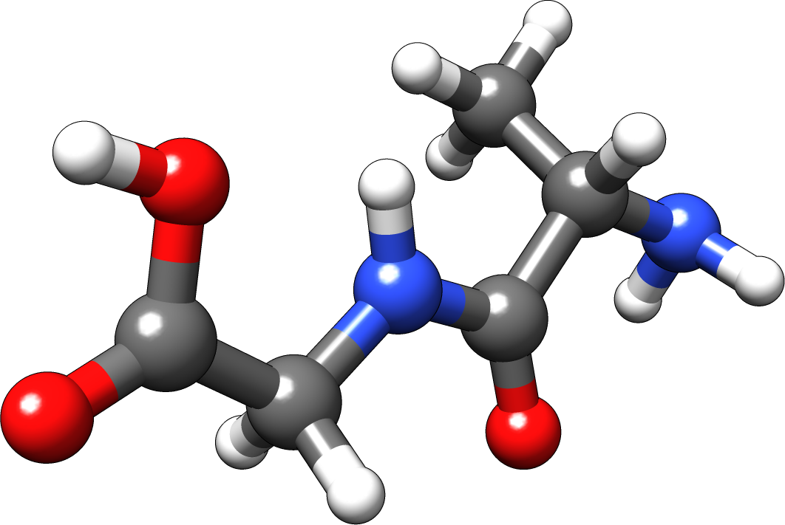

# Atomic Coordination Numbers

### Introduction

The concept of atomic coordination numbers \(CNs\) has been introduced by Grimme and co-workers. CNs represent hybridisation conditions for atoms inside a molecular environment that agrees quite well with chemical intuition. Within the `kallisto` program CNs are calculated in a pairwise sum that incorporates atomic covalent radii as introduced by Pyykkö. Furthermore, the differences in atomic electronegativities has been introduced for each pair as shown in its definition below with `k0 = 7.5`, `k1= 4.1`, `k2 = 19.1`, and `k3 = 254.6`

$$
CN_i = \sum\limits_i^N\sum\limits_{j \ne i} \frac{\delta_{AB}^{EN}}{2}\left( 1 + \text{erf}\left(-k_0\left(\frac{R_{AB}-R_{AB}^{cov}}{R_{AB}}\right)\right) \right)
\\
\text{where} \quad \delta_{AB}^{EN} = \left( k_1 \exp\left(|EN_A - EN_B| + k_2 \right)^2\right)/k_3
$$

Here, Pauling electronegativities \(`EN`\), the internuclear distance of pair AB \(`RAB`\), and covalent atomic radii \(`RcovAB = RcovA + RcovB`\). 

### Simple Example

As usual we invoke `kallisto` via the command line. Please note that you need a valid molecular structure either in an `xmol` format \(\*.xyz in Ångström\) or in the `Turbomole` format \(coord in Bohr\). We exemplify the calculation of atomic coordination numbers \(CNs\) for the alanine-glycine molecule.

```text
> cat alanine-glycine.xyz
  20

C     2.081440     0.615100    -0.508430
C     2.742230     1.824030    -1.200820
N     4.117790     1.799870    -1.190410
C     4.943570     2.827040    -1.822060
C     6.440080     2.569360    -1.637600
O     7.351600     3.252270    -2.069090
N     0.610100     0.695090    -0.538780
O     2.095560     2.724940    -1.739670
O     6.705220     1.463410    -0.897460
H     0.303080     1.426060     0.103770
H     0.338420     1.050680    -1.460480
C     2.488753    -0.593400    -1.198448
H     2.416500     0.557400     0.532050
H     4.614100     1.081980    -0.670550
H     4.699850     3.794460    -1.373720
H     4.722890     2.844690    -2.894180
H     7.687400     1.448620    -0.860340
H     2.029201    -1.457008    -0.719999
H     2.170233    -0.542411    -2.238576
H     3.572730    -0.688405    -1.154998
```



To calculate coordination numbers, we simply call the subcommand `cns` within `kallisto`

```text
> kallisto --verbose cns --inp alanine-glycine.xyz
[3.98207181 3.00785834 2.99800682 3.98095768 2.993322   1.00025168
 2.99979217 1.00140949 1.98927904 0.99678598 0.9964672  4.0016192
 0.9932187  0.99711911 0.99333844 0.99320143 0.99209619 0.99397073
 0.99397068 0.99397075]
```

We obtain a list of atomic coordination numbers, which is in agreement with chemical intuition, e.g., nitrogen atoms \(position 3 and 7 within the input file\) have CN-values of approximately three, hydrogen atoms of approximately one, respectively.

