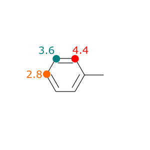

# Proximity Shells

### Introduction

Proximity shells (`P`) are calculated by increasing the covalent atomic radii within the definition of [coordination number](cns.md#introduction). Here, the user is able to define the outer and inner limit by the `size` flag that is used as a scaling parameter in the calculation of proximity shells

$$
P_{i}^{(k,l)} = CN_{i}\left(R^{cov'}_{AB} = k\times R^{cov}_{AB}\right) - CN_{i}\left(R^{cov'}_{AB} = l\times R^{cov}_{AB}\right)  \text{with} \quad k>l
$$

This atomic feature is useful to determine the steric hindrance that occurs due to neighbouring groups. The depiction below exemplifies this for the toluene molecule with `k=3` and `l=2` (see [Applications part](prox.md#application)), where larger P-values show a higher steric hindrance in the near neighbourhood.



### Define the Subcommands



```bash
> kallisto prox options arguments
```



```markup
  # note that the inner (smaller) border is given first
 --size <int> <int>
 (optional, default: 2 3)
 description:
  defines inner and outer border for proximity shells
  
--out <string> 
(optional)
description: 
 write output to file
```



```bash
input file is given as (positional) argument
```



### Application

Let's calculate proximity shells for the toluene molecule by calling the subcommand  `prox` 

```bash
> cat toluene.xyz
15
Toluene
  C      1.2264      0.0427      0.0670
  C      1.0031     -1.3293      0.0600
  C     -0.2945     -1.8256     -0.0060
  C     -1.3704     -0.9461     -0.0646
  C     -1.1511      0.4266     -0.0578
  C      0.1497      0.9292      0.0066
  C      0.3871      2.3956     -0.0022
  H      2.2495      0.4310      0.1211
  H      1.8510     -2.0202      0.1071
  H     -0.4688     -2.9062     -0.0109
  H     -2.3926     -1.3347     -0.1157
  H     -2.0006      1.1172     -0.1021
  H      0.5024      2.7582     -1.0330
  H      1.2994      2.6647      0.5466
  H     -0.4475      2.9470      0.4506
# Note that the default sizes are l, k = 2, 3
> kallisto prox toluene.xyz
4.381228500236796
3.3677521535602004
2.8495247846705114
3.366999124462712
4.382826391660659
2.5949138877345828
2.1800188277556742
4.125179817959886
3.9722691198666404
3.801239033949839
3.972333555437317
4.128082932610809
3.7384516775418555
4.073729305140565
4.075067940009211
# Save output to file 'prox'
> kallisto prox --out prox toluene.xyz
> cat prox
4.381228500236796
3.3677521535602004
2.8495247846705114
3.366999124462712
4.382826391660659
2.5949138877345828
2.1800188277556742
4.125179817959886
3.9722691198666404
3.801239033949839
3.972333555437317
4.128082932610809
3.7384516775418555
4.073729305140565
4.075067940009211
```
