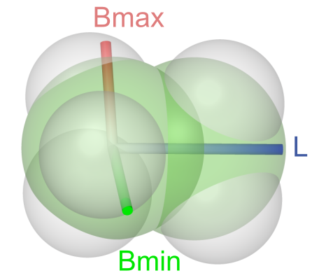

# Sterimol Descriptors

## Introduction

An example of how the Sterimol descriptors of an ethane molecule along the C2-C5 bond are constructed is shown below \(depiction is taken from [here](https://github.com/bobbypaton/DBSTEP)\). For the calculation of Sterimol descriptors `kallisto` uses van-der-Waals radii that are obtained from atomic static polarizabilities as described in the section [van-der-Waals Radii](https://app.gitbook.com/@ehjc/s/kallisto/~/drafts/-MRAfxINKqRBUyA1POhp/features/vdw). 


This Sterimol algorithm has been initially implemented in the [Morfeus](https://kjelljorner.github.io/morfeus/sterimol.html) software package and was integrated by permission of its [main developer](https://scholar.google.com/citations?hl=de&user=85jiD4EAAAAJ).





## Define the Subcommand



```bash
> kallisto stm options arguments
```



```markup
--inp <string> 
(optional, default: coord)
description: 
 input file in xmol format (Ångström) or in Turbomole format (Bohr)

# Note that the atom count starts at 0
--origin <int>
(required)
description:
 number of the origin atom

# Note that the atom count starts at 0
--partner <int>
(required)
description:
 number of the partner atom
```



```text
output: 
 standard output or specified file
```



## Application

To calculate Sterimol parameter for an ethane molecule along the C2-C5 bond, we use the subcommand `stm`

```bash
> cat ethane.xyz
8
ethane
H    0.00 0.00 0.00
C    0.00 0.00 -1.10
H    -1.00    0.27 -1.47
H    0.27 -1.00 -1.47
C    1.03 1.03 -1.61
H    1.03 1.03 -2.71
H    2.03 0.76 -1.25
H    0.76 2.03 -1.25
# Note that the counting of atoms starts at 0
> kallisto stm --inp ethane.xyz --origin 1 --partner 4
Calculated for atom 1 (origin) and atom 4 (partner)
L, Bmin, Bmax / au:  6.29  4.27  4.54
L, Bmin, Bmax / A:  3.33  2.26  2.40
# Save output to file 'stm'
> kallisto --verbose stm --inp ethane.xyz --origin 1 --partner 4 stm
> cat stm
Calculated for atom 1 (origin) and atom 4 (partner)
L, Bmin, Bmax / au:  6.29  4.27  4.54
L, Bmin, Bmax / A:  3.33  2.26  2.40
```

