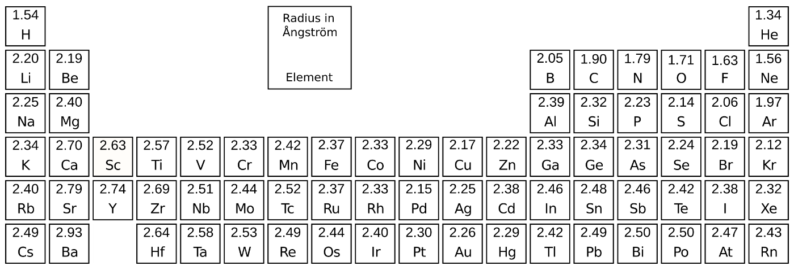

# van-der-Waals Radii

## Introduction

Atomic van-der-Waals \(vdW\) radii are calculated from atomic polarizabilities as recently introduced by Fedorov _et al._ \(see their [arXiv](https://arxiv.org/abs/1803.11507)\). In their work, they obtained a quantum-mechanical relation between atomic polarizabilities and vdW radii.

$$
R_{vdw}(\alpha) = \theta_a \alpha^{1/7},
$$

where `thetaa = 2.54` has been obtained by fitting to reference data for noble gases. Since the present model should be easily applicable to all elements up to Radon, an additional element-wise parameter `thetab` is introduced and fitted to reproduce theoretically determined vdW radii \(see works of [Rahm](https://chemistry-europe.onlinelibrary.wiley.com/doi/abs/10.1002/chem.201602949) and [Mantina](https://pubs.acs.org/doi/10.1021/jp8111556)\).

$$
R_{vdw}(\alpha) = \theta_a \theta_b\alpha^{1/7}
$$

We apply static atomic polarizabilities for the calculation of vdW radii. The graphic below depicts calculated vdW radii for all atoms up to Radon \(CN = 0, q = 0\).



## Define the Subcommand



```bash
> kallisto --verbose vdw options arguments
```



```markup
--inp <string> 
(optional, default: coord)
description: 
 input file in xmol format (Ångström) or in Turbomole format (Bohr)

--chrg <int>
(optional, default: 0)
description:
 absolute charge (qtotal) of the input structure (Lagrangian constraint)

 --vdwtype <string>
 (optional, default: rahm)
 description:
  reference atomic van der Waals radii
   rahm: 10.1002/chem.201700610
   truhlar: 10.1021/jp8111556

--angstrom (flag)
(optional, default: radii in Bohr)
description:
 calculate van-der-Waals radii in Ångström
```



```text
output: 
 standard output or specified file
```



## Application

To calculate atomic van-der-Waals radii for a neutral charged Alanine-Glycine molecule, we call the subcommand `vdw`

```bash
> kallisto --verbose vdw --inp alanine-glycine.xyz
3.3065606171598922
3.38164759676716
3.4391750162303536
3.311855692814488
3.3790680338248973
3.2967634203187104
3.4727151121721547
3.2976318319108247
3.3094215076503897
2.420916892530216
2.4135730093586507
3.356462625678808
2.5457085831894677
2.4274072320381417
2.5251614207290154
2.527093029228339
2.409141369050233
2.540154025796337
2.536646925483585
2.5536833297719026
# Save output to file 'vdw'
> kallisto --verbose vdw --inp alanine-glycine.xyz vdw
3.3065606171598922
3.38164759676716
3.4391750162303536
3.311855692814488
3.3790680338248973
3.2967634203187104
3.4727151121721547
3.2976318319108247
3.3094215076503897
2.420916892530216
2.4135730093586507
3.356462625678808
2.5457085831894677
2.4274072320381417
2.5251614207290154
2.527093029228339
2.409141369050233
2.540154025796337
2.536646925483585
2.5536833297719026
```

Now we obtain a list of atomic van-der-Waals radii. However, we can furthermore calculate van-der-Waals radii for the cationic \(or anionic\) Alanine-Glycine molecule by incorporating the `chrg` option as described in the subcommand definition.

