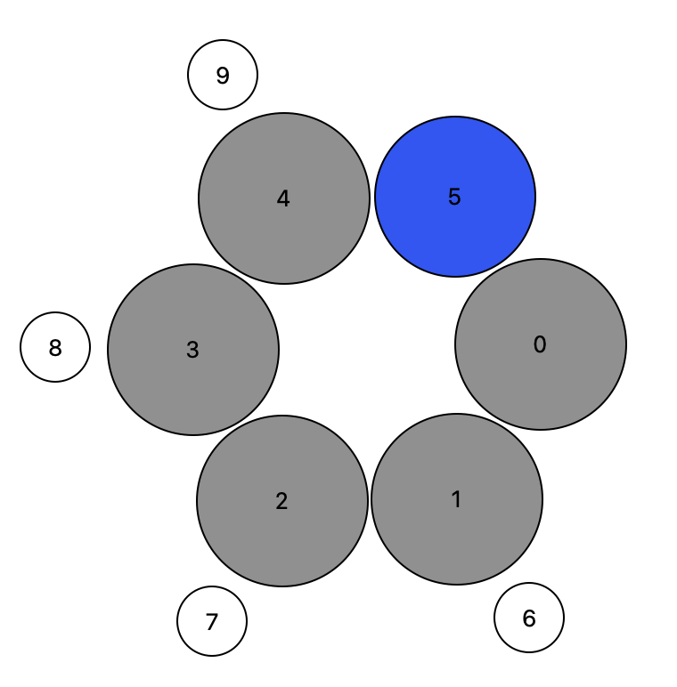

# Substructure Exchanger

## Introduction

Often we simply want to modify existing molecular structures in an automated way, which is always a little tricky. The `kallisto` program implements an easy way to exchange substructures within a molecular structure by another substructure. For the definition of substructures and the way we find them in `kallisto` check out the section [Substructure Finder](https://app.gitbook.com/@ehjc/s/kallisto/~/drafts/-MRdiDzTh2KOJX8DLE81/modelling/lig). The easiest way to introduce you to the substructure exchanger is by going through several examples \(see below\).

## Define the Subcommand



```bash
> kallisto --verbose exs options arguments
```



```markup
--inp <string> <string>
(required)
description: 
 two input files in xmol format (Ångström) 
 or in Turbomole format (Bohr). Both formats need
 to match. First <string> is the reference and 
 second <string> the new structure 

# Note that the atom count starts at 0
--center <int>
(required)
description:
 central atom for which covalently bound substructures are obtained

# Note that the substructure count starts at 0
--subnr <int>
(required)
description:
 substructure to be replaced by new structure
 
 # Note that the substructre count starts at 0
 --rotate <int>
 (optional, defaut = 0)
 description:
  rotate the substrate around the covalent bond defined
  between the center and the first atom in substrate.
  Angle has to be given in degrees.
```



```text
output: 
 standard output or specified file
```



## Application

Let's take the example given in the section [Substructure Finder](https://app.gitbook.com/@ehjc/s/kallisto/~/drafts/-MRdiDzTh2KOJX8DLE81/modelling/lig) and exchange the benzene substrate with another one. Since this example describes the transition state of an oxidative addition we have to keep track that the new substrate misses one Hydrogen atom at the exchange position. We decided to exchange with pyridine molecule \(ortho to Nitrogen\).




Note that the substrate exchanger needs the exchange position to be the first atom inside the structure.


