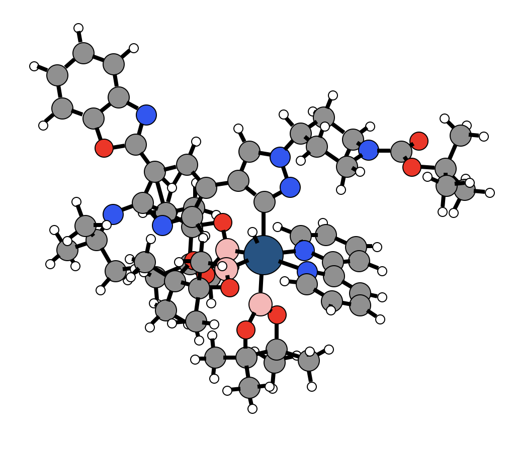
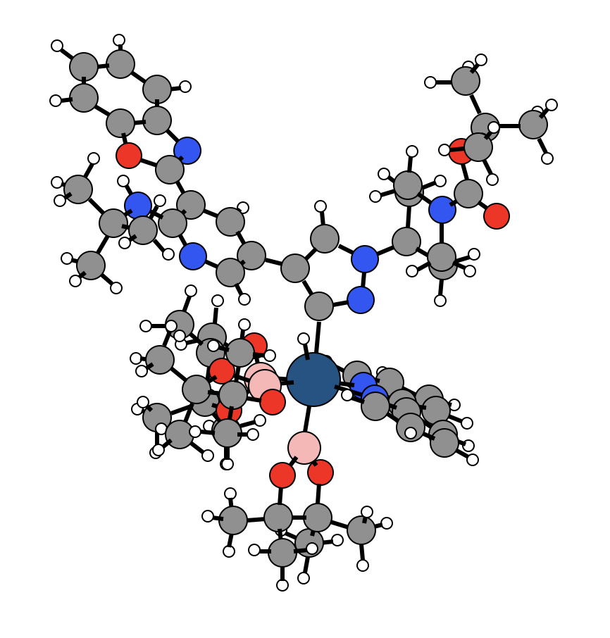

# Substructure Exchanger

## Introduction

Often we simply want to modify existing molecular structures in an automated way, which is always a little tricky. The `kallisto` program implements an easy way to exchange substructures within a molecular structure by another substructure. For the definition of substructures and the way we find them in `kallisto` check out the section [Substructure Finder](https://app.gitbook.com/@ehjc/s/kallisto/~/drafts/-MRdiDzTh2KOJX8DLE81/modelling/lig). The easiest way to introduce you to the substructure exchanger is by going through several examples \(see below\).

## Define the Subcommand



```bash
> kallisto --verbose exs options arguments
```



```markup
--inp <string> <string>
(required)
description: 
 two input files in xmol format (Ångström) 
 or in Turbomole format (Bohr). Both formats need
 to match. First <string> is the reference and 
 second <string> the new structure 

# Note that the atom count starts at 0
--center <int>
(required)
description:
 central atom for which covalently bound substructures are obtained

# Note that the substructure count starts at 0
--subnr <int>
(required)
description:
 substructure to be replaced by new structure

 # Note that the substructre count starts at 0
 --rotate <int>
 (optional, defaut = 0)
 description:
  rotate the substrate around the covalent bond defined
  between the center and the first atom in substrate.
  Angle has to be given in degrees.
```



```text
output: 
 standard output or specified file
```



## Application

Let's take the example given in the section [Substructure Finder](https://app.gitbook.com/@ehjc/s/kallisto/~/drafts/-MRdiDzTh2KOJX8DLE81/modelling/lig) and exchange the benzene substrate with another one. Since this example describes the transition state of an oxidative addition we have to keep track that the new substrate misses one Hydrogen atom at the exchange position. We decided to exchange with pyridine molecule \(ortho to Nitrogen\).



Note that the substrate exchanger needs the exchange position to be the first atom inside the structure.


To exchange benzene with pyridine, we need to know the substructure number of benzene within the complex. Here we take the result from the example given in the section [Substructure Finder](https://app.gitbook.com/@ehjc/s/kallisto/~/drafts/-MRdkU9-SqjnamgQtEMU/modelling/lig); benzene has substructure number `2`. Furthermore, the Iridium atom has to be specified according to the numbering inside the complex, which is `18`.

Now we call the subcommand `exs` to exchange the benzene substructure with the new pyridine one. This generates a new `xmol` file \(termed `newstructure.xyz`\) that incorporates the new structure.

```text
> cat pyridine.xyz
10
Pyridine without H in ortho position of N
  C      1.3603      0.0256      0.0000
  C      0.6971     -1.2020      0.0000
  C     -0.6944     -1.2184      0.0000
  C     -1.3895     -0.0129      0.0000
  C     -0.6712      1.1834      0.0000
  N      0.6816      1.1960      0.0000
  H      1.2665     -2.1365      0.0000
  H     -1.2365     -2.1696      0.0000
  H     -2.4837      0.0011      0.0000
  H     -1.1569      2.1657      0.0000
> kallisto --verbose exs --inp iridium.xyz pyridine.xyz --center 18 --subnr 2
# New geometry has been written to 'newstructure.xyz'
> cat newstructure.xyz
   95
Created with kallisto
N     -1.3673   -1.4399    0.1359
C     -2.4912   -0.6809    0.1396
C     -3.6535   -1.1212   -0.5090
C     -3.6469   -2.3435   -1.1726
C     -2.4849   -3.1188   -1.1556
C     -1.3671   -2.6317   -0.4883
H     -0.4373   -3.1873   -0.4306
H     -2.4433   -4.0867   -1.6464
H     -4.5576   -0.5224   -0.4887
C     -2.4207    0.5909    0.8955
N     -1.2880    0.7904    1.6182
C     -1.1379    1.9349    2.3085
C     -2.1078    2.9320    2.3220
C     -3.2771    2.7403    1.5820
C     -3.4331    1.5601    0.8609
H     -4.3268    1.4058    0.2659
H     -1.9412    3.8420    2.8914
H     -0.1872    2.0460    2.8182
Ir     0.4009   -0.6062    1.1173
H      0.8510   -0.7174    2.6637
B      0.6393    0.6221   -0.5924
O     -0.0586    0.3754   -1.7752
C      0.0637    1.5388   -2.6276
C      0.0955    1.0795   -4.0822
H      0.8717    0.3276   -4.2398
H      0.2802    1.9249   -4.7548
H     -0.8682    0.6331   -4.3492
C     -1.1761    2.4078   -2.3667
H     -1.2043    3.2868   -3.0194
H     -2.0718    1.8059   -2.5500
H     -1.2020    2.7411   -1.3248
C      1.3892    2.1924   -2.1030
O      1.3916    1.7860   -0.7129
C      2.6482    1.5976   -2.7493
H      2.6574    0.5124   -2.6284
H      2.7187    1.8557   -3.8109
H      3.5310    1.9919   -2.2376
C      1.4300    3.7173   -2.1671
H      0.6242    4.1646   -1.5815
H      2.3813    4.0764   -1.7611
H      1.3477    4.0652   -3.2033
B      2.0757    0.4378    1.7667
O      3.3655   -0.0810    1.8672
C      4.2710    1.0316    2.0580
C      5.4820    0.5534    2.8528
H      5.1839    0.0640    3.7826
H      6.0491   -0.1689    2.2568
H      6.1443    1.3929    3.0940
C      4.6910    1.5018    0.6584
H      5.4399    2.2998    0.7064
H      5.1091    0.6484    0.1171
H      3.8182    1.8506    0.1015
C      3.3503    2.0657    2.7943
O      2.0459    1.7443    2.2508
C      3.6591    3.5301    2.4960
H      3.5359    3.7465    1.4333
H      2.9754    4.1761    3.0566
H      4.6848    3.7777    2.7931
C      3.2797    1.8274    4.3084
H      3.0709    0.7748    4.5226
H      4.2124    2.1094    4.8081
H      2.4672    2.4303    4.7259
B      1.7918   -1.7490    0.1412
O      1.8501   -3.1468    0.2110
C      3.0570   -3.5803   -0.4612
C      4.1633   -3.6179    0.6030
H      4.3273   -2.6174    1.0150
H      3.8421   -4.2740    1.4175
H      5.1056   -3.9993    0.1957
C      2.8262   -4.9694   -1.0467
H      2.6793   -5.6907   -0.2364
H      3.6908   -5.2905   -1.6390
H      1.9393   -4.9912   -1.6840
C      3.2641   -2.4331   -1.5049
O      2.7239   -1.2953   -0.7999
C      4.7167   -2.1414   -1.8719
H      5.1882   -3.0189   -2.3294
H      4.7566   -1.3171   -2.5913
H      5.2942   -1.8489   -0.9926
C      2.4198   -2.6280   -2.7729
H      1.3753   -2.8207   -2.5122
H      2.4502   -1.7102   -3.3668
H      2.7925   -3.4537   -3.3879
H     -4.5415   -2.6927   -1.6822
H     -4.0523    3.5021    1.5577
C      0.2001   -2.2076    2.6787
C      1.3101   -2.9162    3.1399
C      1.1301   -3.8975    4.1100
C     -0.1496   -4.1480    4.5958
C     -1.2211   -3.4069    4.0962
N     -1.0429   -2.4535    3.1531
H      2.3064   -2.7005    2.7420
H      1.9862   -4.4664    4.4870
H     -0.3174   -4.9144    5.3587
H     -2.2525   -3.5543    4.4358
```

Ok, this seems to be working quite nicely, but what happens when we exchange with largere substructures? Let's takle one such problem by exchanging with a c-Met Kinase Inhibitor

```bash
> cat cmet.xyz
   73
Created with kallisto
C     -4.8579   -0.2541    2.8380
C     -3.8074   -0.6686    2.0030
C     -5.6903   -1.2392    3.3856
N     -2.8308    0.0583    1.3763
C     -3.6298   -2.0135    1.7390
C     -5.4923   -2.5931    3.0900
H     -6.4941   -0.9444    4.0602
C     -2.0561   -0.8580    0.8080
C     -4.4517   -3.0160    2.2465
O     -2.5185   -2.1426    0.9555
H     -6.1550   -3.3337    3.5362
C     -0.7520   -0.6113    0.1756
H     -4.2878   -4.0611    2.0190
C      0.1755   -1.5727   -0.2603
C     -0.3447    0.7443    0.1258
N     -0.0790   -2.9304   -0.3006
N      1.4046   -1.2067   -0.6777
C      0.9299    1.1065   -0.2988
H     -1.0370    1.5189    0.4550
C      0.9956   -3.9448   -0.2162
H     -0.8556   -3.1549   -0.9135
C      1.7660    0.0847   -0.6811
C      1.4106    2.4641   -0.3061
C      1.4775   -3.9809    1.2455
C      0.3659   -5.2950   -0.6105
C      2.2135   -3.7576   -1.1450
H      2.7930    0.2563   -0.9903
C      2.3941    3.0757   -1.1131
C      1.0484    3.4434    0.5914
H      0.6389   -3.8980    1.9464
H      2.1516   -3.1408    1.4559
H      2.0232   -4.9022    1.4715
H     -0.6290   -5.4288   -0.1754
H      0.9955   -6.1366   -0.3012
H      0.2530   -5.3579   -1.7013
H      2.8826   -2.9518   -0.8258
H      1.9134   -3.5649   -2.1804
H      2.8436   -4.6562   -1.1382
N      2.6361    4.3342   -0.7537
H      2.9535    2.6509   -1.9382
N      1.8316    4.5280    0.3059
H      0.3510    3.4486    1.4182
C      1.8813    5.7730    1.0633
C      1.0124    6.8617    0.4276
C      3.3119    6.2656    1.3267
H      1.4428    5.5197    2.0388
C      1.6921    7.5182   -0.7680
H      0.8205    7.6325    1.1851
H      0.0367    6.4594    0.1292
C      3.9346    6.9937    0.1362
H      3.2744    6.9678    2.1698
H      3.9608    5.4367    1.6364
N      3.0255    7.9928   -0.4196
H      1.0691    8.3418   -1.1304
H      1.7974    6.8114   -1.6001
H      4.8711    7.4537    0.4663
H      4.2005    6.3068   -0.6735
C      3.4682    9.2042   -0.9364
O      4.7876    9.4141   -0.6926
O      2.7445   10.0017   -1.5189
C      5.4363   10.6718   -1.0172
C      4.7763   11.8444   -0.2802
C      6.8795   10.5002   -0.5114
C      5.4760   10.9179   -2.5288
H      4.5007   11.5688    0.7431
H      3.8577   12.1649   -0.7836
H      5.4361   12.7186   -0.2429
H      6.9020   10.0055    0.4666
H      7.4054   11.4573   -0.4318
H      7.4562    9.8614   -1.1914
H      4.4759   11.0709   -2.9448
H      5.9044   10.0570   -3.0536
H      6.0736   11.8048   -2.7667
# Exchange benzene with c-Met Kinase Inhibitor
> kallisto --verbose exs --inp iridium.xyz cmet.xyz --center 18 --subnr 2
```

Again the new structure is saved into `newstructure.xyz`. By taking a closer look onto this structure, we see that atoms seem to clash into each other - "[no bueno](https://www.quora.com/What-does-no-bueno-mean-in-English)".



To overcome this failure, the `kallisto` program writes out constrainment files that are intended to be used in combination with the open source [xtb tight-binding scheme](https://github.com/grimme-lab/xtb). The created constrainment files can now be used to repair the structure within a constrained geometry optimization. The constraints fix the complex and enable only the new substrate to relax.

```bash
> xtb newstructure.xyz --opt tight --alpb thf --input constrain.inp
```

After optimising  the geometry successfully, we obtain a reasonable complex \(see depiction below\). This approach reduces the complexity of the exchange algorithm tremendously since we solve the exchange problems by applying a physically motivated scheme instead of empirical rules like, e.g., a template based substrate exchange.




