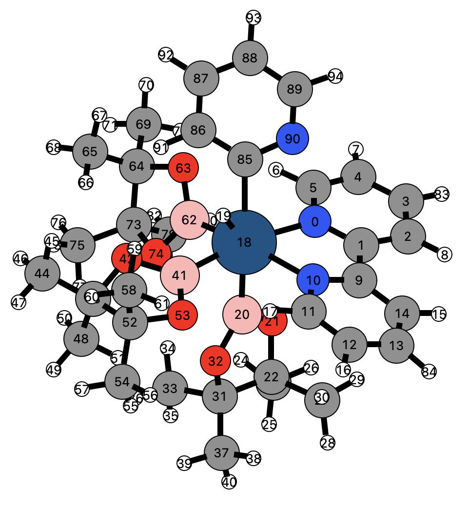

# Substructure Finder

## Introduction

Often we are interested in the finding substructures, e.g., ligands that are covalently bound to a metal center within an organometallic catalyst. Here, we need information about the molecular graph. This information is, however, not adequate enough to write out ligands or other substructures. Within the `kallisto` program we implemented a recursive way to deal with substructures that are covalently bound to a specified atom \(termed as the `center`\).



## Define the Subcommand



```bash
> kallisto --verbose lig options arguments
```



```markup
--inp <string> 
(optional, default: coord)
description: 
 input file in xmol format (Ångström) or in Turbomole format (Bohr)

# Note that the atom count starts at 0
--center <int>
(required)
description:
 central atom for which covalently bound substructures are obtained
```



```text
output: 
 standard output or specified file
```



## Application

