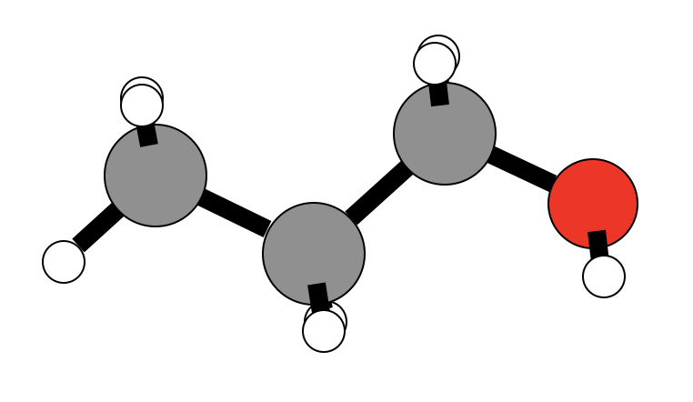
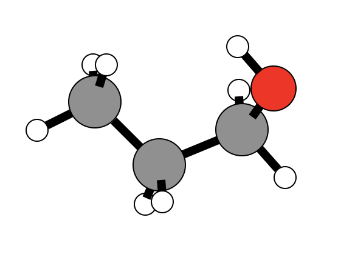

# Root Mean Square Deviation

## Introduction

A widely used way to compare the structures is to translate and rotate one structure with respect to the other to minimize the root mean square deviation \(RMSD\). We implemented a simple scheme, based on quaternions, for the optimal transformation \(rotation-translation\) that minimizes the RMSD between two sets of structures. Quaternions are generally represented in the form

$$
q = a+b\,\mathbf{i} +c\,\mathbf {j} +d\,\mathbf {k}
$$

with `a`, `b`, `c`, and `d` as real numbers; and **i**, **j**, and **k** as the fundamental quaternion units. The set of quaternions is made a four-dimensional vector space over the real numbers {1, **i**, **j**, **k**} as a basis, where Hamilton defined the quaternion as consisting of a scalar part and a vector part. The vector part of the quaternion can be interpreted as a coordinate in three dimensional space. Operations such as the vector dot product and cross products can be defined in terms of quaternions, and this makes it possible to apply quaternion techniques wherever spatial vectors arise.

After setting up the quaternion \(4x4 matrix\), the largest eigenvalue is calculated by 1\) estimation via [Gershgorin's theorem](https://en.wikipedia.org/wiki/Gershgorin_circle_theorem) followed by a 2\) single value decomposition to obtain the eigenvalues of the matrix. We use the eigenvector corresponding to the largest eigenvalue to create a rotation matrix, which is then used to match the two structures.

## Define the Subcommand



```bash
> kallisto rms options arguments
```



```markup
--compare <string> <string>
(required)
description: 
 compare two input files in xmol format (Ångström) 
 or in Turbomole format (Bohr) and calculate a RMSD 
 error and a rotation matrix
```



```text
output:
 standard output or specified file
```



## Application

As an example let's compare two conformers of 1-propanol that we have obtained by applying the [conformer rotamer ensemble sampling tool](https://github.com/grimme-lab/crest).



```bash
> cat 1-propanol_lowest.xyz
  12
  
 C         -1.9554949371        0.1467391618        0.0031595607
 C         -0.5906278346       -0.5279387138       -0.0201649611
 C          0.5440986558        0.4958779663        0.0283462055
 H          0.4812068385        1.1678478833       -0.8308000219
 H          0.4590669813        1.0993020658        0.9450529713
 O          1.8195161785       -0.0957487212       -0.0534239359
 H          1.9103706588       -0.7338049177        0.6631507673
 H         -0.5004127933       -1.2028008461        0.8364936998
 H         -0.4854009629       -1.1250023438       -0.9282499098
 H         -2.7476736372       -0.5972665554       -0.0242488945
 H         -2.0700756998        0.8040326560       -0.8554507953
 H         -2.0722381370        0.7410005769        0.9069567477
```



```bash
> cat 1-propanol_higher.xyz
12

C       -1.60306996       0.10333519       0.50792736
C       -0.66904416      -0.46962566      -0.55371646
C        0.67345677       0.26436258      -0.61179298
H        1.26292797      -0.10585085      -1.45392921
H        0.49744830       1.34089332      -0.75955140
O        1.47742183       0.05176805       0.52349829
H        0.98773122       0.34094585       1.30125393
H       -0.48213061      -1.52528483      -0.34815476
H       -1.14165995      -0.39229359      -1.53423716
H       -2.56608070      -0.40007121       0.47312929
H       -1.76619136       1.16652831       0.34003517
H       -1.19366144      -0.03197289       1.50775619
```

Let's calculate the RMSD error and the rotation matrix

```bash
> kallisto rms --compare 1-propanol_lowest.xyz 1-propanol_higher.xyz
RMSD [1.12070194] Angstrom
Rotation Matrix
[[ 0.98139458 -0.04965545 -0.18546973]
 [ 0.06170977  0.9963015   0.05979323]
 [ 0.18181471 -0.07012604  0.98082911]]
```

