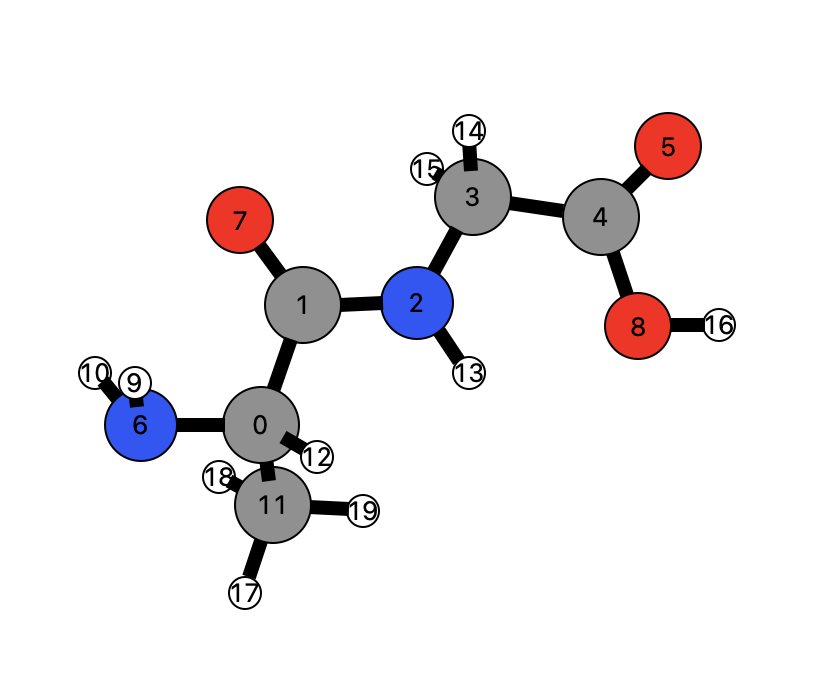
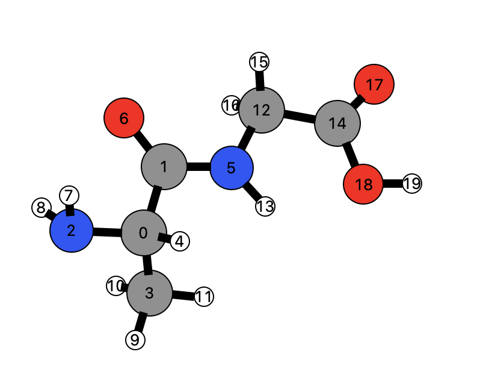

# Breadth First Sorting

## Introduction

Breadth First Search \(BFS\) algorithm traverses a graph in a breadth-ward motion and uses a queue to remember to get the next vertex to start a search, when a dead end occurs in any iteration \(depiction below taken from [here](https://www.tutorialspoint.com/data_structures_algorithms/breadth_first_traversal.htm)\).


The BFS algorithm employs the following rules.

1. Visit the adjacent unvisited vertex and mark it as visited. Then display it and insert it in a queue.
2. If no adjacent vertex is found, remove the first vertex from the queue.
3. Repeat Rule 1 and Rule 2 until the queue is empty.

## Define the Subcommand



```bash
> kallisto sort options arguments
```



```markup
--inp <string> 
(optional, default: coord)
description: 
 input file in xmol format (Ångström) or in Turbomole format (Bohr)

# Note that the atom count starts at 0
--start <int>
(optional)
description:
 start BFS from given atom
```



```text
output: 
 standard output or specified file
```



## Application

#### Simple example: Ethane

To sort an ethane molecule according to a BFS algorithms, we use the subcommand `sort`

```bash
> cat ethane.xyz
8
ethane
C    0.00 0.00 -1.10
H    2.03 0.76 -1.25
H    -1.00    0.27 -1.47
H    0.27 -1.00 -1.47
H    1.03 1.03 -2.71
C    1.03 1.03 -1.61
H    0.76 2.03 -1.25
H    0.00 0.00 0.00
# Save BFS sorted structure to 'ethane_s.xyz'
> kallisto sort --inp ethane.xyz --start 0 > ethane_s.xyz
> cat ethane_s.xyz
    8
Created with kallisto
C      0.0000    0.0000   -1.1000
H     -1.0000    0.2700   -1.4700
H      0.2700   -1.0000   -1.4700
C      1.0300    1.0300   -1.6100
H      0.0000    0.0000    0.0000
H      2.0300    0.7600   -1.2500
H      1.0300    1.0300   -2.7100
H      0.7600    2.0300   -1.2500
```

The depiction below shows the sorting for the ethane molecule. On the left side the initial coordinates are shown, while the right side presents the BFS sorted structure with `start = 0`. Note that the atom declared by `start` will always be the first atom in the sorted structure.


#### More advanced example: Alanine-glycine

Let's increase the difficulty a little bit, we choose the alanine-glycine molecule from our [Examples](https://app.gitbook.com/@ehjc/s/kallisto/~/drafts/-MVPwY8o6UiDbKvkMkld/example). First we take the unsorted molecule in an `xmol` format



```bash
> cat alanine-glycine.xyz
  20

C     2.081440     0.615100    -0.508430
C     2.742230     1.824030    -1.200820
N     4.117790     1.799870    -1.190410
C     4.943570     2.827040    -1.822060
C     6.440080     2.569360    -1.637600
O     7.351600     3.252270    -2.069090
N     0.610100     0.695090    -0.538780
O     2.095560     2.724940    -1.739670
O     6.705220     1.463410    -0.897460
H     0.303080     1.426060     0.103770
H     0.338420     1.050680    -1.460480
C     2.488753    -0.593400    -1.198448
H     2.416500     0.557400     0.532050
H     4.614100     1.081980    -0.670550
H     4.699850     3.794460    -1.373720
H     4.722890     2.844690    -2.894180
H     7.687400     1.448620    -0.860340
H     2.029201    -1.457008    -0.719999
H     2.170233    -0.542411    -2.238576
H     3.572730    -0.688405    -1.154998
```

We want to sort this structure according to the BFS algorithm described above. Here, we choose to sort everything starting from the atom having index `0` .

```bash
# Save BFS sorted structure to 'alanine_glycine_s.xyz'
> kallisto sort --inp alanine-glycine.xyz --start 0 > alanine_glycine_s.xyz
> cat alanine_glycine_s.xyz
   20
Created with kallisto
C      2.0814    0.6151   -0.5084
C      2.7422    1.8240   -1.2008
N      0.6101    0.6951   -0.5388
C      2.4888   -0.5934   -1.1984
H      2.4165    0.5574    0.5321
N      4.1178    1.7999   -1.1904
O      2.0956    2.7249   -1.7397
H      0.3031    1.4261    0.1038
H      0.3384    1.0507   -1.4605
H      2.0292   -1.4570   -0.7200
H      2.1702   -0.5424   -2.2386
H      3.5727   -0.6884   -1.1550
C      4.9436    2.8270   -1.8221
H      4.6141    1.0820   -0.6705
C      6.4401    2.5694   -1.6376
H      4.6998    3.7945   -1.3737
H      4.7229    2.8447   -2.8942
O      7.3516    3.2523   -2.0691
O      6.7052    1.4634   -0.8975
H      7.6874    1.4486   -0.8603
```



We obtain the following sorted structure where the covalent partner of atom `0` are: `1`, `2`, `3`, and `4`. Once we habe identified all partner we go on with index `1` and identify it's partners: `5` and `6` . After visiting all indices we have a BFS sorted molecule! 🎉

