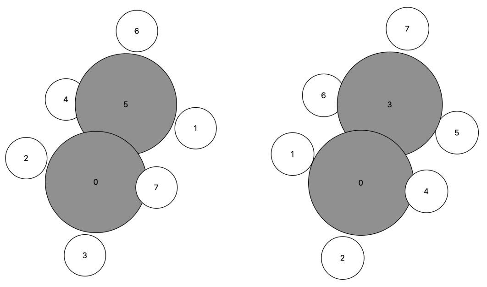

# Breadth First Sorting

### Introduction

Breadth First Search \(BFS\) algorithm traverses a graph in a breadth-ward motion and uses a queue to remember to get the next vertex to start a search, when a dead end occurs in any iteration.


As in the example given above, BFS algorithm traverses from `A` to `B` to `E` to `F` first then to `C` and `G` lastly to `D`. It employs the following rules.

1.  Visit the adjacent unvisited vertex. Mark it as visited. Display it. Insert it in a queue.
2. If no adjacent vertex is found, remove the first vertex from the queue.
3. Repeat Rule 1 and Rule 2 until the queue is empty.

### Define the Subcommand



```bash
> kallisto --verbose sort options arguments
```



```markup
--inp <string> 
(optional, default: coord)
description: 
 input file in xmol format (Ångström) or in Turbomole format (Bohr)
 
# Note that the atom count starts at 0
--start <int>
(optional)
description:
 start BFS from given atom
```



```
output: 
 standard output or specified file
```



### Application

To sort an ethane molecule according to a breadth-first algorithms us the subcommand `sort`

```bash
> cat ethane.xyz
8
ethane
C	0.00 0.00 -1.10
H	2.03 0.76 -1.25
H	-1.00	0.27 -1.47
H	0.27 -1.00 -1.47
H	1.03 1.03 -2.71
C	1.03 1.03 -1.61
H	0.76 2.03 -1.25
H	0.00 0.00 0.00
# Save BFS sorted structure to 'ethane_s.xyz'
> kallisto sort --inp ethane.xyz --start 0 > ethane_s.xyz
> cat ethane_s.xyz
    8
Created with kallisto
C      0.0000    0.0000   -1.1000
H     -1.0000    0.2700   -1.4700
H      0.2700   -1.0000   -1.4700
C      1.0300    1.0300   -1.6100
H      0.0000    0.0000    0.0000
H      2.0300    0.7600   -1.2500
H      1.0300    1.0300   -2.7100
H      0.7600    2.0300   -1.2500
```

The depiction below shows the sorting for the ethane molecule. On the left side the initial coordinates are shown, while the right side presents the BFS sorted structure with `start = 0`. Note that the atom declared by `start` will always be the first atom in the sorted structure.



